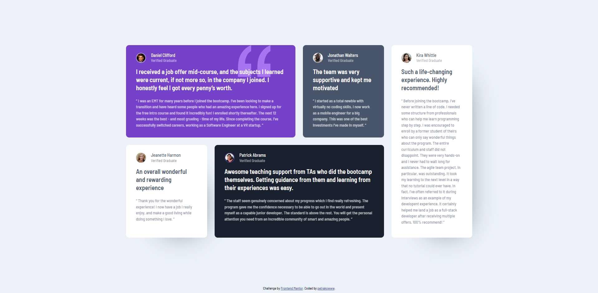
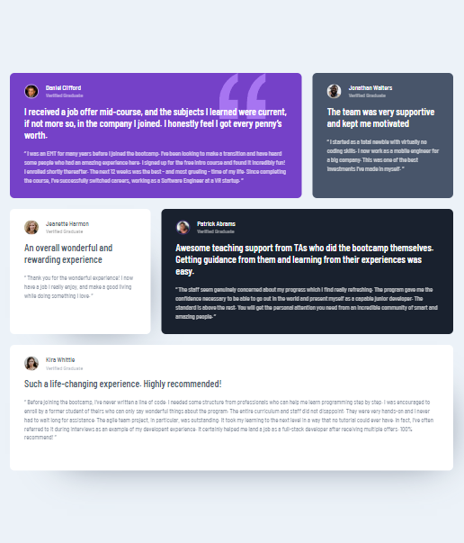
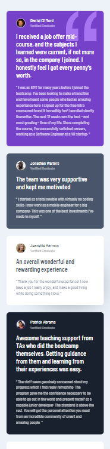

# Frontend Mentor - Testimonials grid section solution

This is a solution to the [Testimonials grid section challenge on Frontend Mentor](https://www.frontendmentor.io/challenges/testimonials-grid-section-Nnw6J7Un7). Frontend Mentor challenges help you improve your coding skills by building realistic projects.

## Table of contents

-   [Overview](#overview)
    -   [The challenge](#the-challenge)
    -   [Screenshot](#screenshot)
    -   [Links](#links)
-   [My process](#my-process)
    -   [Built with](#built-with)
    -   [What I learned](#what-i-learned)
    -   [Continued development](#continued-development)

## Overview

### The challenge

Users should be able to:

-   View the optimal layout for the site depending on their device's screen size

### Screenshot

### Links

-   Solution: [solution](https://www.frontendmentor.io/challenges/testimonials-grid-section-Nnw6J7Un7)
-   Live Site: [github page](https://your-live-site-url.com)

## My process

### Built with

-   Semantic HTML5 markup
-   CSS custom properties
-   SASS/SCSS
-   CSS Grid
-   Mobile-first workflow
-   Media queries

### What I learned

In this work, I improved my skills with the grid, practiced creating and changing it depending on the width of the screen, worked with positioning and, of course, with media queries.

### Continued development

I also want to learn how to make up grid layouts faster, use templates and then start making up pages with js functionality
